# Getting Started with ML-Agents & Unity


Train your own ML-agents on limited resources, condemning them to be ✨ _dummy_ ✨
(but very much loved), and compare them with the best agents in the field.

<p align="center">
    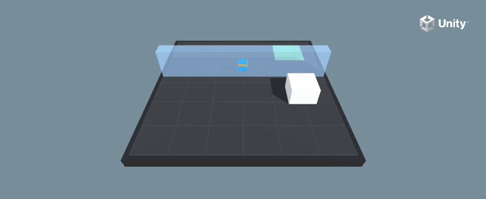
    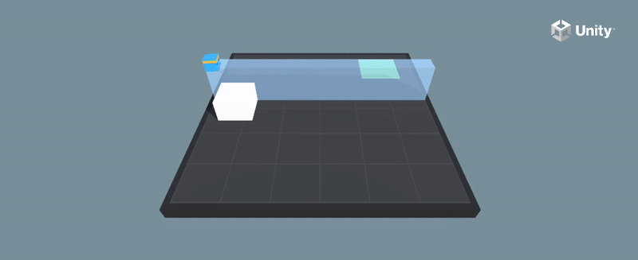
    
    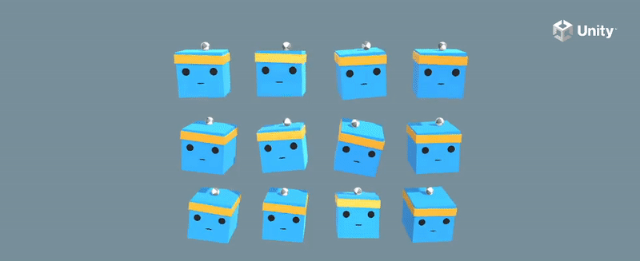
    <i>On the left the custom-trained agents, on the right the best agents.</i>
</p>

## Setup
Download [Unity Hub](https://unity.com/download) and from there install
the editor `2021.3.11f1` (in official releases, the `LTS` version).<br>
Download also the most recent stable release of
[ML-Agents](https://github.com/Unity-Technologies/ml-agents).
<p align="center">
    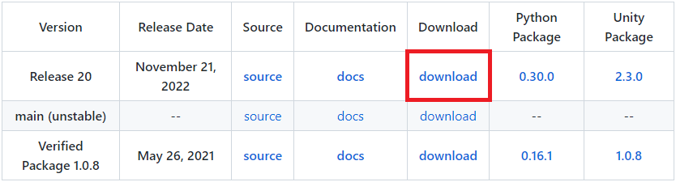
</p>

Open Unity Hub and import the folder `Project` from the previously downloaded
ML-Agents package. 
<p align="center">
    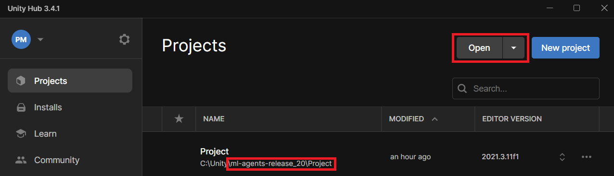
</p>
Then, open the project by double-clicking on it.

Since we'll train our own agents, we also have to set up python properly.<br>
Open the previously downloaded folder ML-Agents in the terminal, and execute:
```commandline
pip install -e ml-agents
pip install -e ml-agents-envs
```
<i>Note. To do it properly, it is suggested to create a virtual environment.</i>

## Train the Agents
Move to the opened Unity project and, down-left, navigate to 
`Project > Assets > ML-Agents > Examples > 3DBall > Scenes`.<br> 
Double-click the folder `Scenes` and then double-click the file `3DBall`.

<p align="center">
    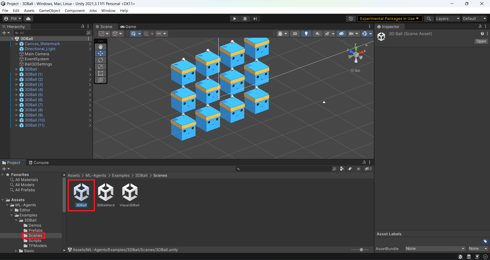
</p>

About the 3D balance ball game:
> _The 3D Balance Ball environment contains a number of agent cubes and balls_
> _(which are all copies of each other)_.<br>
> _Each agent cube tries to keep its ball from falling by rotating either_
> _horizontally or vertically._<br>
> _In this environment, an agent cube is an Agent that receives a reward for_
> _every step that it balances the ball._<br>
> _An agent is also penalized with a negative reward for dropping the ball._<br>
> _The goal of the training process is to have the agents learn to balance_
> _the ball on their head._

By pressing the play button in the top center we can see how the pre-trained 
agents perform.
<p align="center">
    
</p>

To train our own agents, we need to open the ML-Agents folder from the
terminal and execute the following command:
```commandline
mlagents-learn config/ppo/3DBall.yaml --run-id=first_run_3dball
```
where `mlagents-learn` is the general command to interact with the ML-Agents
framework, the `config/ppo/3DBall.yaml` specifies the settings of the training,
namely:
```yaml
behaviors:
  3DBall:
    trainer_type: ppo
    hyperparameters:
      batch_size: 64
      buffer_size: 12000
      learning_rate: 0.0003
      beta: 0.001
      epsilon: 0.2
      lambd: 0.99
      num_epoch: 3
      learning_rate_schedule: linear
    network_settings:
      normalize: true
      hidden_units: 128
      num_layers: 2
      vis_encode_type: simple
    reward_signals:
      extrinsic:
        gamma: 0.99
        strength: 1.0
    keep_checkpoints: 5
    max_steps: 500000
    time_horizon: 1000
    summary_freq: 12000
```
and `--run-id=first_run_3dball` creates a new folder called `first_run_3dball`
with every information and output of this run. 

At this point, the response from `mlagents-learn` will be:
```commandline
[INFO] Listening on port 5004. Start training by pressing the Play button in the Unity Editor.
```
When this information appears, we need to move to Unity and press play.<br>
Now the training has started. We can see how the agents train within Unity:
<p align="center">
    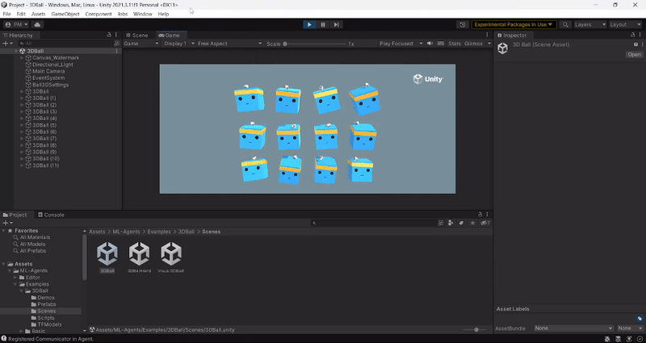
</p>

And we can also see some numbers in the terminal:
```commandline
[INFO] 3DBall. Step: 12000.  Time Elapsed: 27.143 s.  Mean Reward: 1.136.  Std of Reward: 0.710.  Training.
[INFO] 3DBall. Step: 24000.  Time Elapsed: 44.679 s.  Mean Reward: 1.424.  Std of Reward: 0.889.  Training.
[INFO] 3DBall. Step: 36000.  Time Elapsed: 60.184 s.  Mean Reward: 2.095.  Std of Reward: 1.211.  Training.
[INFO] 3DBall. Step: 48000.  Time Elapsed: 74.971 s.  Mean Reward: 3.351.  Std of Reward: 2.606.  Training.
[INFO] 3DBall. Step: 60000.  Time Elapsed: 90.024 s.  Mean Reward: 8.022.  Std of Reward: 6.551.  Training.
[INFO] 3DBall. Step: 72000.  Time Elapsed: 104.211 s. Mean Reward: 20.102. Std of Reward: 23.587. Training.
[INFO] 3DBall. Step: 84000.  Time Elapsed: 119.592 s. Mean Reward: 53.427. Std of Reward: 37.335. Training.
[INFO] 3DBall. Step: 96000.  Time Elapsed: 133.754 s. Mean Reward: 80.107. Std of Reward: 29.116. Training.
[INFO] 3DBall. Step: 108000. Time Elapsed: 147.332 s. Mean Reward: 95.433. Std of Reward: 13.151. Training.
[INFO] 3DBall. Step: 120000. Time Elapsed: 161.466 s. Mean Reward: 90.929. Std of Reward: 23.583. Training.
..
```
During training, we keep track of the mean reward of the agents and its
standard deviation.

To interrupt the training press `CTRL` + `C`.
```commandline
[INFO] Learning was interrupted. Please wait while the graph is generated.
[INFO] Exported results\first_run_3dball\3DBall\3DBall-130071.onnx
[INFO] Copied results\first_run_3dball\3DBall\3DBall-130071.onnx to results\first_run_3dball\3DBall.onnx.
```
The current (last, before interruption) state is saved in the folder
`results/first_run_3dball`.

## Check the Agents Performance
It is not enough to have trained a behavioral model, we now need to tell the
agents to use the new model instead of the standard one.

First of all, go to the folder `results/first_run_3dball` and rename the file
`3DBall.onnx` in `3DBall_beginner.onnx` (or whatever, but somehow different).<br>
Then, navigate to `Project > Assets > ML-Agents > Examples > 3DBall > TFModels `:
<p align="center">
    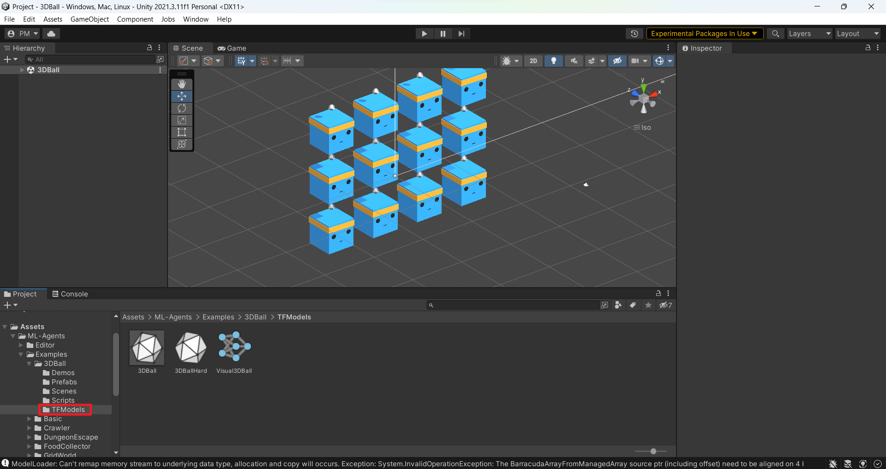
</p>

Drag the model `3DBall_beginner.onnx` and drop it here:
<p align="center">
    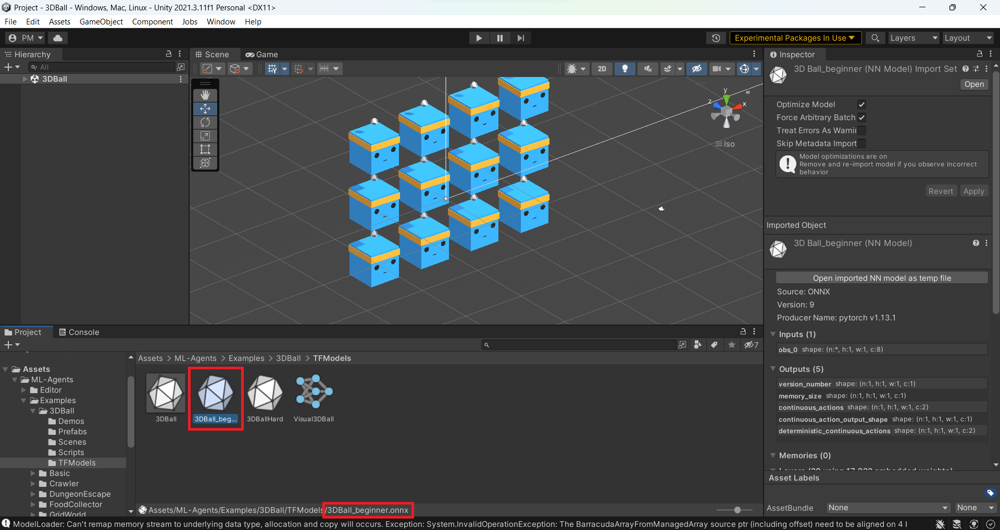
</p>

Now, navigate to `Project > Assets > ML-Agents > Examples > 3DBall > Prefabs`
and double-click the element `3DBall`.
<p align="center">
    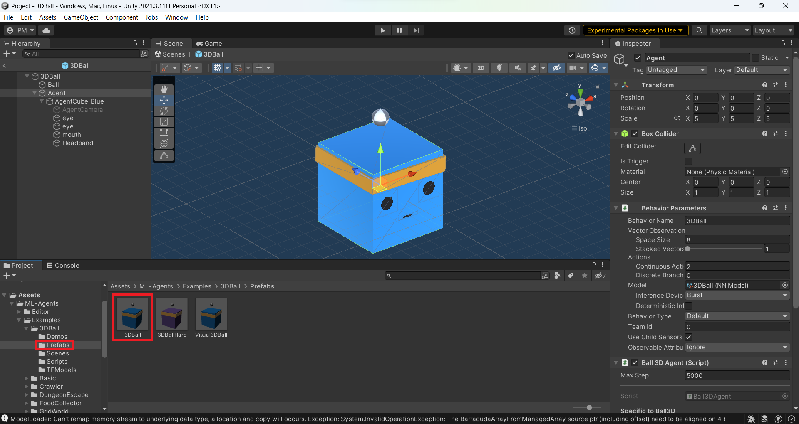
</p>

Consider now the window on the up-left and double-click on `Agent`.<br>
What we need to modify is the behavioral model the agents use (window on the right):
<p align="center">
    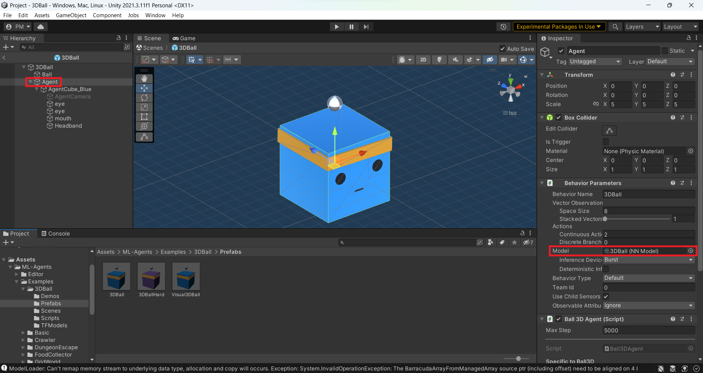
</p>

In the window on the right, in the section `model`, click the dot and select the
model we previously introduced:
<p align="center">
    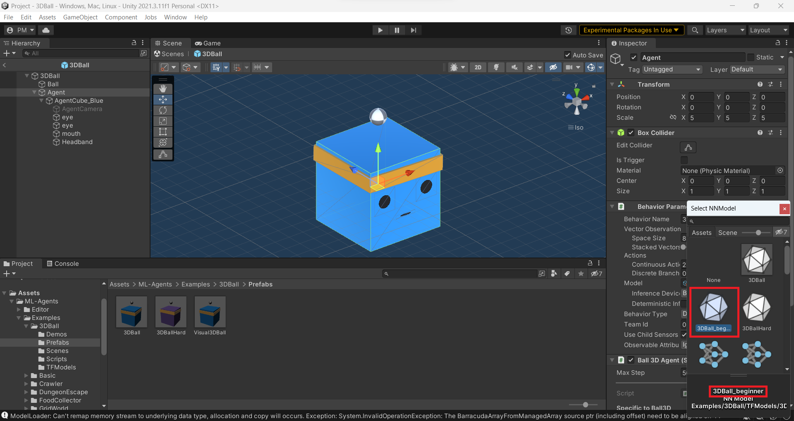
</p>

Now by pressing play we can see the agents following the newest behavioral model:
<p align="center">
    
</p>